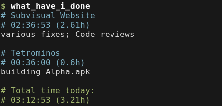

# What have I done?

Give me a readable recap of everything I logged into Toggl today.
This should save me about 20 seconds every day. After a year, that'll sum up to more than an hour, so yeah...

# What does this do exactly?

Glad you asked. Let me show you:

# I want this

1. Install: `gem install what_have_i_done`
2. Get your Toggl API Key from [your profile page](https://www.toggl.com/app/profile) and store it in `~/.toggl`
3. Use at will: `what_have_i_done`

Pro tip: `alias what="what_have_i_done"`

# Why the f***?

Because I'm currently doing this manually every day to fill in our company's daily report (for time tracking, billing, and blah blah <corporate giberish> blah productivity blah)

# Roadmap

The next step would be to have this automatically submit the report in some way.
